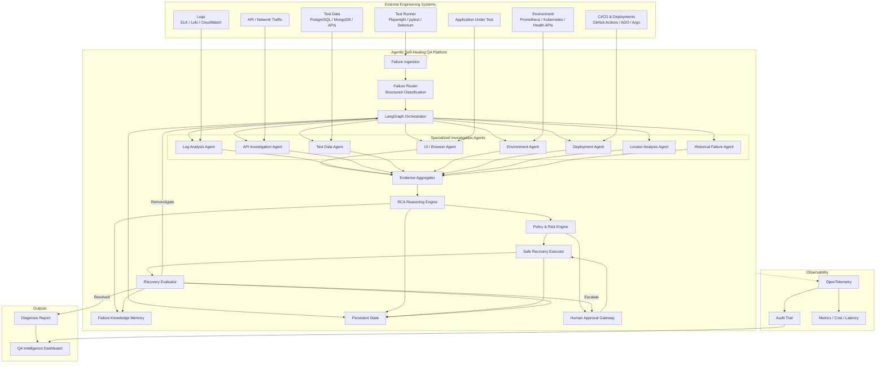
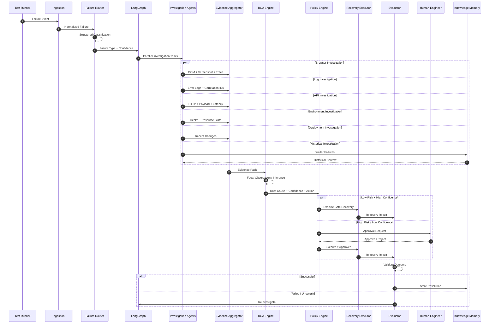
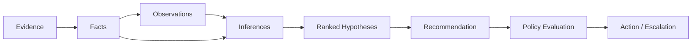
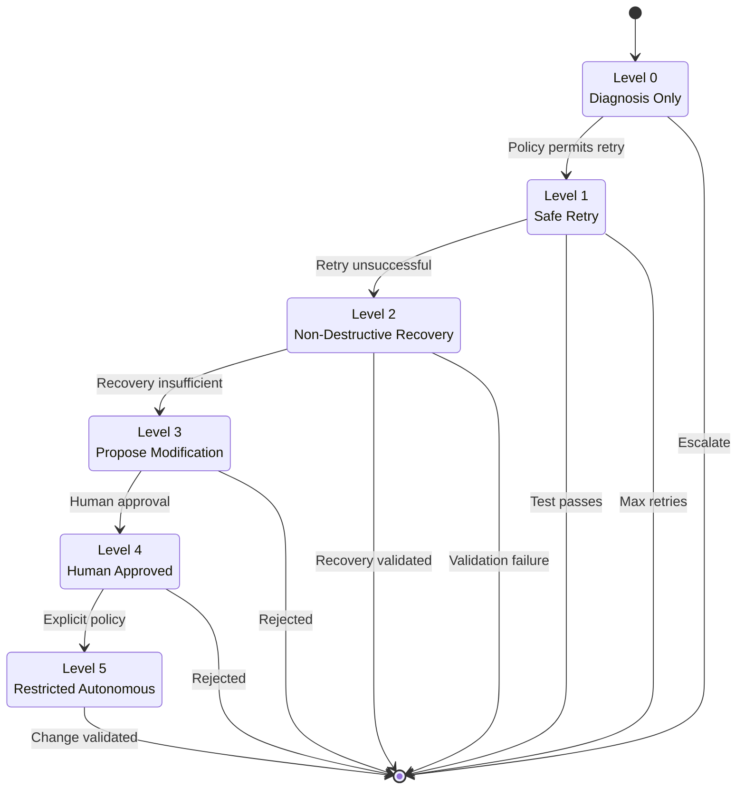
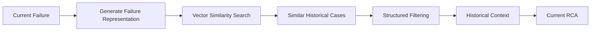
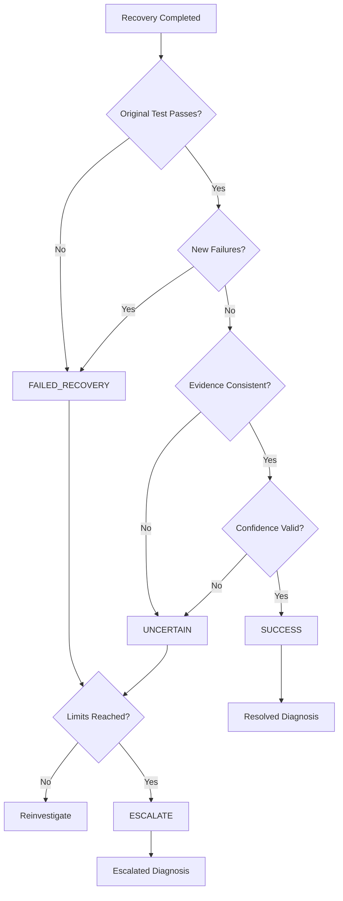
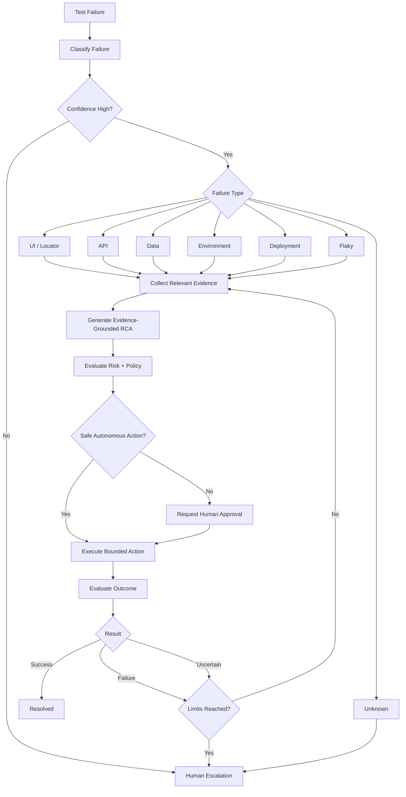

# 🤖 Agentic Self-Healing QA System

### Autonomous Failure Investigation • Evidence-Grounded RCA • Bounded Self-Healing • Human-Controlled Automation

<p align="center">


</p>

<p align="center">

> **Detect → Investigate → Reason → Decide → Safely Act → Validate → Explain → Escalate**

</p>

---

## 🧠 What Is This?

**Agentic Self-Healing QA System** is an enterprise-oriented AI platform designed to investigate automated test failures, gather evidence from multiple engineering systems, determine probable root causes, safely attempt bounded recovery actions, validate the outcome, and produce an explainable diagnosis.

Instead of treating a failed test as the end of an automation pipeline:

```text
Test
  ↓
FAIL
  ↓
Human investigates everything manually
```

the system turns the failure into an autonomous investigation workflow:

```text
┌─────────────────────────────────────────────────────────────┐
│                  AGENTIC QA INVESTIGATION                   │
└─────────────────────────────────────────────────────────────┘

 Test Failure
      │
      ▼
 Failure Ingestion
      │
      ▼
 Structured Failure Classification
      │
      ▼
 Dynamic Investigation Planning
      │
      ├──────────────┬──────────────┬──────────────┐
      ▼              ▼              ▼              ▼
   Browser         Logs           APIs          Environment
   Agent           Agent          Agent            Agent
      │              │              │              │
      └──────────────┴──────────────┴──────────────┘
                           │
                           ▼
                  Evidence Aggregation
                           │
                           ▼
                  Historical Knowledge
                           │
                           ▼
                    RCA Reasoning
                           │
                           ▼
                    Action Selection
                           │
              ┌────────────┴────────────┐
              ▼                         ▼
        Safe Autonomous            Human Approval
           Action                       │
              │                         │
              └────────────┬────────────┘
                           ▼
                       Validation
                           │
                ┌──────────┴──────────┐
                ▼                     ▼
             RESOLVED              ESCALATED
                │                     │
                └──────────┬──────────┘
                           ▼
                  Auditable Diagnosis
```

The platform is **not designed to blindly "fix everything with AI."**

Its core philosophy is:

> **Use deterministic workflows whenever the path is known. Use agentic reasoning only when dynamic investigation is genuinely required.**

---

# 🎯 The Problem

Modern QA teams can execute thousands of automated tests, but failure investigation still depends heavily on human engineers.

A typical failure lifecycle looks like:

```text
Test Failed
    ↓
Open CI Report
    ↓
Read Stack Trace
    ↓
Open Screenshot
    ↓
Inspect DOM
    ↓
Check Browser Console
    ↓
Check API Calls
    ↓
Search Application Logs
    ↓
Check Deployment History
    ↓
Check Environment
    ↓
Check Test Data
    ↓
Search Previous Failures
    ↓
Form Hypothesis
    ↓
Retry Test
    ↓
Determine Whether It Is Fixed
    ↓
Write RCA
```

This creates several problems:

* High manual triage effort
* Slow feedback to developers
* Flaky test noise
* Repeated investigation of identical failures
* Loss of organizational knowledge
* Poor RCA consistency
* Unnecessary test retries
* Increased release risk
* Difficulty scaling QA with test volume

---

# 🚀 The Solution

This system introduces an **Agentic Failure Investigation Layer** between test execution and human engineering.

### Traditional QA

```text
             ┌───────────────┐
             │ Test Runner   │
             └───────┬───────┘
                     │
                     ▼
                  FAILURE
                     │
                     ▼
             ┌───────────────┐
             │ Human Engineer│
             └───────────────┘
```

### Agentic QA

```text
             ┌───────────────┐
             │ Test Runner   │
             └───────┬───────┘
                     │
                     ▼
             ┌───────────────┐
             │ Failure Router│
             └───────┬───────┘
                     │
                     ▼
             ┌───────────────┐
             │ Orchestrator  │
             └───────┬───────┘
                     │
          ┌──────────┼──────────┐
          ▼          ▼          ▼
       Browser     Logs        API
        Agent      Agent       Agent
          │          │          │
          └──────────┼──────────┘
                     ▼
             ┌───────────────┐
             │ Evidence      │
             │ Aggregator    │
             └───────┬───────┘
                     │
                     ▼
             ┌───────────────┐
             │ RCA Agent     │
             └───────┬───────┘
                     │
                     ▼
             ┌───────────────┐
             │ Action Policy │
             └───────┬───────┘
                     │
             ┌───────┴────────┐
             ▼                ▼
        Safe Action        Human Gate
             │                │
             └───────┬────────┘
                     ▼
                Evaluator
                     │
              ┌──────┴──────┐
              ▼             ▼
           Resolved      Escalated
```

---

# ✨ Core Capabilities

| Capability                   | Description                                            |
| ---------------------------- | ------------------------------------------------------ |
| 🔍 Failure Detection         | Normalize failures from automated test frameworks      |
| 🧭 Failure Classification    | Categorize failures using structured reasoning         |
| 🧠 Agentic Investigation     | Dynamically determine what evidence is required        |
| 🌐 Browser Investigation     | Analyze DOM, screenshots, traces and console errors    |
| 📜 Log Investigation         | Correlate application, test and infrastructure logs    |
| 🔌 API Investigation         | Analyze HTTP failures, payloads, latency and contracts |
| 🗄️ Test Data Investigation  | Validate test data and preconditions                   |
| ☁️ Environment Investigation | Check service health and resource pressure             |
| 🚀 Deployment Correlation    | Correlate failures with recent deployments             |
| 🧬 Locator Intelligence      | Analyze broken locators and propose candidates         |
| 🧠 Historical Memory         | Reuse knowledge from previous failures                 |
| 🧩 Evidence Aggregation      | Combine evidence from multiple specialized agents      |
| 🧠 Explainable RCA           | Separate facts from observations and hypotheses        |
| 🛡️ Bounded Self-Healing     | Execute only policy-approved recovery actions          |
| 👨‍💻 Human-in-the-Loop      | Escalate risky or uncertain decisions                  |
| 🔬 Recovery Validation       | Verify whether the failure was actually resolved       |
| 📊 Full Auditability         | Trace every decision, tool call and state transition   |
| 📈 Observability             | OpenTelemetry-based tracing and metrics                |

---

# 🏗️ High-Level Architecture



---

# 🧠 Core Design Philosophy

This project follows eight architectural principles.

## 1. Bounded Autonomy

Agents never receive unlimited authority.

Every action is controlled by:

```text
Risk
+
Confidence
+
Policy
+
Environment
+
Action Type
+
Retry Limits
```

---

## 2. Deterministic First

If a workflow can be represented deterministically, it should be.

For example:

```text
Failure
  ↓
Retry once
  ↓
Pass?
 ├── YES → Resolve
 └── NO  → Investigate
```

There is no reason to use an LLM to make this decision.

---

## 3. Agentic Only When Needed

Agentic reasoning becomes useful when the system must answer questions such as:

> "Why did this test fail?"

or:

> "Which evidence should I collect next?"

or:

> "Are these three seemingly unrelated symptoms caused by the same deployment?"

---

## 4. Evidence Before Reasoning

The RCA engine cannot simply invent a plausible explanation.

Every conclusion must be traceable to evidence.

```text
FACT
 ↓
OBSERVATION
 ↓
INFERENCE
 ↓
HYPOTHESIS
 ↓
RECOMMENDATION
```

---

## 5. Least Privilege

Agents only receive the tools required for their responsibility.

For example:

```text
Browser Agent
    ├── screenshot
    ├── DOM snapshot
    ├── console logs
    └── browser trace

Log Agent
    └── log search

Deployment Agent
    ├── deployment history
    └── version metadata
```

No agent gets unrestricted system access.

---

## 6. Human Control

The platform is designed to **assist engineers, not eliminate engineering judgment**.

High-risk actions require approval.

```text
LOW RISK
   ↓
Autonomous

MEDIUM RISK
   ↓
Proposal

HIGH RISK
   ↓
Human Approval

UNKNOWN
   ↓
Escalation
```

---

## 7. Everything Is Observable

Every meaningful event is traceable.

```text
Failure
  ↓
Classification
  ↓
Agent Invocation
  ↓
Tool Call
  ↓
Evidence
  ↓
RCA
  ↓
Action
  ↓
Validation
  ↓
Final Decision
```

---

## 8. Safety Over Completeness

The system would rather say:

> "Insufficient evidence — escalate to engineer."

than confidently produce an incorrect diagnosis.

---

# 🔄 End-to-End Investigation Workflow



---

# 🧩 Failure Classification

The Failure Router converts raw test failures into structured failure types.

Supported categories include:

```text
UI_FAILURE
LOCATOR_FAILURE
TIMEOUT_FAILURE
API_FAILURE
DATA_FAILURE
AUTH_FAILURE
ENVIRONMENT_FAILURE
DEPLOYMENT_FAILURE
INFRASTRUCTURE_FAILURE
ASSERTION_FAILURE
FLAKY_FAILURE
UNKNOWN_FAILURE
```

Example:

```json
{
  "failure_type": "LOCATOR_FAILURE",
  "confidence": 0.93,
  "reason": "Expected selector is absent from current DOM",
  "investigation_strategy": [
    "capture_dom",
    "capture_screenshot",
    "inspect_locator_history",
    "check_recent_deployments",
    "search_historical_failures"
  ]
}
```

The important distinction is that classification is not the final RCA.

```text
Classification
      ↓
Investigation
      ↓
Evidence
      ↓
RCA
```

---

# 🤖 Specialized Agent Architecture

The system uses multiple narrowly scoped agents instead of one giant autonomous agent.

| Agent                 | Primary Responsibility                             |
| --------------------- | -------------------------------------------------- |
| 🔍 Log Analysis Agent | Analyze application, test and infrastructure logs  |
| 🌐 Browser Agent      | Inspect DOM, screenshots, traces and browser state |
| 🔌 API Agent          | Analyze requests, responses and contracts          |
| 🗄️ Test Data Agent   | Validate test data and preconditions               |
| ☁️ Environment Agent  | Analyze environment health                         |
| 🚀 Deployment Agent   | Correlate failures with deployments                |
| 🎯 Locator Agent      | Analyze broken locators and candidates             |
| 🧠 Historical Agent   | Retrieve similar historical failures               |
| 🧩 RCA Agent          | Combine evidence and reason about root cause       |
| ⚖️ Policy Engine      | Determine whether actions are permitted            |
| 🔬 Evaluator          | Validate recovery outcome                          |

---

# 🧠 Evidence-Grounded RCA

One of the most important architectural decisions in this project is the separation between different levels of reasoning.

## FACT

Directly observed evidence.

```text
DOM snapshot does not contain:
[data-testid="login-button"]
```

## OBSERVATION

A meaningful pattern derived from evidence.

```text
The login page loaded successfully, but the expected
test identifier is absent.
```

## INFERENCE

A logical conclusion.

```text
The failure is unlikely to be caused by page-load timeout.
```

## HYPOTHESIS

A possible root cause.

```text
Frontend deployment may have changed the login button locator.
```

## RECOMMENDATION

The next action.

```text
Inspect the latest frontend commit and compare the locator
with the last successful test execution.
```

### RCA Chain



### RCA Rule

> **The RCA Agent is never allowed to promote a hypothesis into a fact.**

---

# 🛡️ Six-Level Self-Healing Model

The system uses explicit autonomy levels.



| Level | Name                        | Example                         | Autonomy          |
| ----: | --------------------------- | ------------------------------- | ----------------- |
|     0 | Diagnosis Only              | Generate RCA                    | None              |
|     1 | Safe Retry                  | Retry failed test               | Full              |
|     2 | Non-Destructive Recovery    | Refresh session / re-fetch data | Bounded           |
|     3 | Proposed Modification       | Suggest locator change          | Proposal only     |
|     4 | Human-Approved Modification | Apply approved test change      | Human-controlled  |
|     5 | Restricted Autonomous       | Pre-approved safe fix           | Policy-controlled |

---

# 🔐 Security Model

Security is part of the architecture rather than a later feature.

## Agent Security

```text
                 ┌──────────────────┐
                 │   Policy Engine  │
                 └────────┬─────────┘
                          │
             ┌────────────┼────────────┐
             ▼            ▼            ▼
        Permission     Risk Check    Environment
             │            │            │
             └────────────┼────────────┘
                          ▼
                     Tool Gateway
                          │
                          ▼
                       Tool
```

### Security Controls

* Least-privilege tool access
* Secret isolation
* PII masking
* Token redaction
* Input validation
* Output schema validation
* Network restrictions
* Action allowlists
* Human approval gates
* Immutable audit trail
* Environment-aware permissions
* Production modification restrictions

### Hard Rule

> **No agent receives unrestricted access to production code, production data, infrastructure, credentials, or destructive operations.**

---

# 🔧 Tool Ecosystem

| Tool                        | Purpose                       | Risk   |
| --------------------------- | ----------------------------- | ------ |
| `take_screenshot`           | Capture current browser state | Low    |
| `get_dom_snapshot`          | Inspect DOM                   | Low    |
| `query_logs`                | Search logs                   | Low    |
| `inspect_api_traffic`       | Inspect HTTP traffic          | Low    |
| `check_service_health`      | Check service health          | Low    |
| `get_deployment_history`    | Retrieve deployments          | Low    |
| `validate_test_data`        | Validate test data            | Low    |
| `retry_test`                | Retry failed test             | Low    |
| `refresh_test_data`         | Refresh non-production data   | Medium |
| `propose_locator_update`    | Generate locator candidates   | Medium |
| `query_historical_failures` | Retrieve previous failures    | Low    |

Every tool invocation passes through a controlled gateway:

```text
Agent
  ↓
Tool Request
  ↓
Schema Validation
  ↓
Permission Check
  ↓
Risk Check
  ↓
Timeout
  ↓
Tool Execution
  ↓
Output Sanitization
  ↓
Audit Log
  ↓
Agent
```

---

# 🧠 Historical Failure Memory

The system should not investigate the same failure from zero every time.

Historical memory stores:

```text
Failure Signature
      +
Evidence Summary
      +
RCA
      +
Confidence
      +
Recovery Action
      +
Validation Result
      +
Human Decision
```

Future failures can retrieve similar cases.



### Example

Current failure:

```text
Login button selector not found
```

Historical memory:

```text
Case #1042
Frontend deployment changed login selector
Resolution: locator updated
Confidence: 0.94
Validated: 17/17 runs
```

The historical case becomes **supporting context**, not unquestioned truth.

---

# 🗃️ State Model

The LangGraph state represents the complete investigation lifecycle.

Conceptually:

```text
InvestigationState
│
├── Identity
│   ├── run_id
│   ├── test_id
│   └── failure_id
│
├── Failure Context
│   ├── failure_type
│   ├── failure_message
│   ├── stack_trace
│   ├── environment
│   └── application_version
│
├── Control
│   ├── investigation_count
│   ├── retry_count
│   ├── recovery_attempt_count
│   └── hard_limits
│
├── Evidence
│   ├── evidence_items
│   └── agent_findings
│
├── Reasoning
│   ├── rca_result
│   ├── hypotheses
│   └── confidence
│
├── Action
│   ├── recommended_action
│   ├── executed_action
│   └── action_result
│
├── Human Control
│   ├── approval_required
│   ├── approval_status
│   └── human_notes
│
└── Final
    ├── evaluation_result
    ├── final_diagnosis
    └── status
```

---

# 🔄 Evaluator: Never Assume Recovery Worked

A critical principle:

> **Executing an action successfully does not mean the failure was fixed.**

For example:

```text
retry_test()
     ↓
Process completed
     ↓
Did test pass?
     ↓
Did unrelated failures appear?
     ↓
Is evidence consistent with RCA?
     ↓
Is confidence still valid?
     ↓
SUCCESS / FAILED / UNCERTAIN / ESCALATE
```



---

# 📊 Observability

The system is designed around **OpenTelemetry**.

Every investigation should generate a trace similar to:

```text
investigation.run
│
├── failure.ingestion
│
├── failure.classification
│
├── orchestration.plan
│
├── agent.browser
│   ├── screenshot
│   ├── dom_snapshot
│   └── console_logs
│
├── agent.logs
│   └── query_logs
│
├── agent.api
│   └── inspect_traffic
│
├── agent.environment
│   └── health_check
│
├── memory.search
│
├── rca.reasoning
│
├── policy.evaluate
│
├── recovery.execute
│
├── evaluator.validate
│
└── final.diagnosis
```

### Track

* Investigation latency
* Agent latency
* Tool latency
* Token usage
* Estimated model cost
* Classification confidence
* RCA confidence
* Recovery success rate
* False recovery rate
* Escalation rate
* Tool failure rate
* Evidence completeness
* Human approval rate

---

# 📈 Key Metrics

| Metric                    | Initial Target |
| ------------------------- | -------------: |
| Classification Accuracy   |          ≥ 90% |
| Evidence Completeness     |          ≥ 95% |
| RCA Evidence Coverage     |           100% |
| False Recovery Rate       |           < 5% |
| Investigation Latency     |        < 3 min |
| Unsafe Autonomous Actions |              0 |
| Decision Traceability     |           100% |

These are **engineering targets**, not claims of achieved performance.

---

# 🧪 Example Investigation

## Scenario

```text
Test:
test_login_with_valid_credentials

Failure:
Timeout 30000ms exceeded

Expected:
[data-testid="login-button"]

Actual:
Element not found
```

### Step 1 — Classification

```json
{
  "type": "LOCATOR_FAILURE",
  "confidence": 0.93
}
```

### Step 2 — Investigation

Agents execute in parallel:

```text
Browser Agent
    ↓
DOM + Screenshot

Log Agent
    ↓
Application errors

Deployment Agent
    ↓
Recent frontend deployment

Locator Agent
    ↓
Historical selector comparison

Historical Agent
    ↓
Previous similar failures
```

### Step 3 — Evidence

```text
FACT:
Expected selector is absent.

FACT:
Page rendered successfully.

FACT:
Frontend deployment occurred 18 minutes ago.

OBSERVATION:
Previous successful runs used the same selector.

INFERENCE:
Failure is unlikely to be caused by page-load timeout.

HYPOTHESIS:
Recent frontend deployment changed the login element.

CONFIDENCE:
0.91
```

### Step 4 — Decision

```text
Risk: MEDIUM

Action:
Propose locator update

Autonomous execution:
NO

Human approval:
REQUIRED
```

### Step 5 — Validation

After approval:

```text
Locator updated
      ↓
Test rerun
      ↓
PASS
      ↓
Evaluator validates
      ↓
RESOLVED
```

---

# 🧭 Failure Investigation Decision Tree



---

# 📁 Recommended Repository Structure

```text
agentic-self-healing-qa/
│
├── README.md
├── LICENSE
├── CONTRIBUTING.md
├── SECURITY.md
├── pyproject.toml
├── docker-compose.yml
├── .env.example
│
├── src/
│   ├── api/
│   │   ├── routes/
│   │   └── schemas/
│   │
│   ├── graph/
│   │   ├── state.py
│   │   ├── graph.py
│   │   ├── nodes/
│   │   └── edges/
│   │
│   ├── agents/
│   │   ├── failure_router.py
│   │   ├── log_agent.py
│   │   ├── browser_agent.py
│   │   ├── api_agent.py
│   │   ├── data_agent.py
│   │   ├── environment_agent.py
│   │   ├── deployment_agent.py
│   │   ├── locator_agent.py
│   │   ├── historical_agent.py
│   │   └── rca_agent.py
│   │
│   ├── tools/
│   │   ├── browser/
│   │   ├── logs/
│   │   ├── api/
│   │   ├── deployment/
│   │   ├── environment/
│   │   └── test_data/
│   │
│   ├── policies/
│   │   ├── risk.py
│   │   ├── permissions.py
│   │   └── autonomy.py
│   │
│   ├── recovery/
│   │   ├── retry.py
│   │   ├── session_refresh.py
│   │   └── executor.py
│   │
│   ├── evaluation/
│   │   ├── evaluator.py
│   │   └── validators.py
│   │
│   ├── memory/
│   │   ├── embeddings.py
│   │   ├── retrieval.py
│   │   └── repository.py
│   │
│   ├── persistence/
│   │   ├── models.py
│   │   └── repositories.py
│   │
│   └── observability/
│       ├── tracing.py
│       ├── metrics.py
│       └── audit.py
│
├── tests/
│   ├── unit/
│   ├── integration/
│   ├── graph/
│   ├── agents/
│   ├── tools/
│   └── evaluation/
│
├── diagrams/
│   ├── architecture.md
│   ├── investigation-flow.md
│   ├── self-healing-levels.md
│   ├── rca-reasoning.md
│   ├── failure-router.md
│   └── evaluator.md
│
├── docs/
│   ├── 01_Executive_Summary.md
│   ├── 02_Problem_Statement.md
│   ├── 03_Vision_and_Goals.md
│   ├── 04_High_Level_Architecture.md
│   ├── 05_Core_Workflows_and_Diagrams.md
│   ├── 06_Agent_and_Tool_Design.md
│   ├── 07_State_Data_Security_Observability.md
│   ├── 08_MVP_Roadmap_TechStack.md
│   └── 09_Examples_Risks_Metrics.md
│
└── examples/
    ├── failure-events/
    ├── evidence/
    ├── rca/
    └── recovery/
```

---

# 🛠️ Technology Stack

| Layer               | Technology                    |
| ------------------- | ----------------------------- |
| Language            | Python 3.11+                  |
| Agent Orchestration | LangGraph                     |
| LLM Interface       | Provider-agnostic abstraction |
| Test Automation     | Playwright + pytest           |
| API                 | FastAPI                       |
| Database            | PostgreSQL                    |
| Vector Search       | pgvector                      |
| Observability       | OpenTelemetry                 |
| Frontend            | Next.js + React               |
| Containers          | Docker                        |
| CI/CD               | GitHub Actions                |
| Validation          | Pydantic / JSON Schema        |

---

# 🏛️ Architectural Patterns

This project intentionally combines several Agentic AI patterns.

## Routing

```text
Failure
   ↓
Classifier
   ↓
Failure-specific investigation
```

---

## Parallelization

```text
                 ┌── Browser Agent
                 ├── Log Agent
Failure → Planner ├── API Agent
                 ├── Data Agent
                 ├── Environment Agent
                 └── Deployment Agent
```

---

## Orchestrator-Worker

```text
             Orchestrator
                  │
       ┌──────────┼──────────┐
       ▼          ▼          ▼
    Worker     Worker      Worker
```

---

## Prompt Chaining

```text
Classification
      ↓
Investigation
      ↓
Evidence Aggregation
      ↓
RCA
      ↓
Action Selection
      ↓
Evaluation
```

---

## Evaluator-Optimizer

```text
Action
  ↓
Execute
  ↓
Evaluate
  ↓
 ┌──────────────┐
 │              │
Pass          Fail
 │              │
 ▼              ▼
Done        Reinvestigate
```

---

# 🧩 LangGraph Role

LangGraph acts as the **workflow and state orchestration layer**.

The graph is responsible for:

* Explicit state transitions
* Durable execution
* Checkpointing
* Conditional routing
* Parallel investigation
* Bounded loops
* Human interruption
* Recovery workflows
* Investigation resumption

Conceptually:

```text
                    ┌──────────────┐
                    │   START      │
                    └──────┬───────┘
                           ▼
                  ┌─────────────────┐
                  │ Failure Router  │
                  └────────┬────────┘
                           ▼
                  ┌─────────────────┐
                  │ Investigation   │
                  │ Planner         │
                  └────────┬────────┘
                           │
                ┌──────────┼──────────┐
                ▼          ▼          ▼
             Browser     Logs        API
                │          │          │
                └──────────┼──────────┘
                           ▼
                  ┌─────────────────┐
                  │ Evidence        │
                  │ Aggregator      │
                  └────────┬────────┘
                           ▼
                  ┌─────────────────┐
                  │ RCA Agent       │
                  └────────┬────────┘
                           ▼
                  ┌─────────────────┐
                  │ Policy Engine   │
                  └────────┬────────┘
                           │
                    ┌──────┴──────┐
                    ▼             ▼
                 Action          HITL
                    │             │
                    └──────┬──────┘
                           ▼
                      Evaluator
                           │
                    ┌──────┴──────┐
                    ▼             ▼
                 Success       Replan
```

---

# 🚦 MVP Scope

The first implementation intentionally focuses on three common UI failure classes.

### Supported

```text
UI_FAILURE
LOCATOR_FAILURE
TIMEOUT_FAILURE
```

### MVP Flow

```text
pytest / Playwright
       ↓
Failure Ingestion
       ↓
Classification
       ↓
Parallel Evidence
       ↓
Historical Search
       ↓
RCA
       ↓
Safe Retry / Session Refresh
       ↓
Evaluator
       ↓
Resolved / Escalated
```

### MVP Does NOT Include

* Autonomous production code modification
* Unrestricted test rewriting
* Autonomous infrastructure modification
* Production database mutation
* Fully autonomous high-risk changes
* Every possible failure class
* Multi-framework support initially

---

# 🗺️ Roadmap

```text
PHASE 1
Failure Ingestion
       │
       ▼
PHASE 2
Failure Classification
       │
       ▼
PHASE 3
Parallel Evidence Collection
       │
       ▼
PHASE 4
Evidence-Grounded RCA
       │
       ▼
PHASE 5
Safe Recovery
       │
       ▼
PHASE 6
Evaluator + HITL
       │
       ▼
PHASE 7
Historical Memory
       │
       ▼
PHASE 8
Advanced Locator Intelligence
       │
       ▼
PHASE 9
Production Observability
       │
       ▼
PHASE 10
Enterprise Scale
```

| Phase | Deliverable               |
| ----: | ------------------------- |
|     1 | Failure ingestion         |
|     2 | Structured classification |
|     3 | Evidence agents           |
|     4 | RCA engine                |
|     5 | Safe recovery             |
|     6 | Evaluator + HITL          |
|     7 | Historical memory         |
|     8 | Advanced self-healing     |
|     9 | Production observability  |
|    10 | Enterprise platform       |

---

# ⚠️ Failure Handling

The platform is designed for failure at every layer.

| Failure                       | Expected Behavior                           |
| ----------------------------- | ------------------------------------------- |
| LLM returns invalid JSON      | Retry / constrained regeneration / escalate |
| Agent times out               | Record partial evidence                     |
| Browser unavailable           | Continue other investigations               |
| Logs unavailable              | Lower evidence completeness                 |
| Conflicting evidence          | Surface conflict                            |
| Low RCA confidence            | Escalate                                    |
| Recovery fails                | Reinvestigate                               |
| Retry limit reached           | Escalate                                    |
| State corruption              | Abort safely                                |
| Duplicate failure             | Deduplicate                                 |
| Historical memory unavailable | Continue without historical context         |

---

# 🚫 Anti-Patterns

This project intentionally avoids:

### ❌ One Giant Agent

```text
"Here are all the tools. Figure everything out."
```

Instead:

```text
Specialized Agents
+
Least Privilege
+
Explicit Orchestration
```

### ❌ Unlimited Retry

```python
while not success:
    retry()
```

Instead:

```text
retry_count < max_retries
```

### ❌ Free-Form Critical Decisions

Critical decisions use schemas:

```json
{
  "failure_type": "...",
  "confidence": 0.0,
  "risk": "...",
  "action": "...",
  "evidence_ids": []
}
```

### ❌ Blind Self-Healing

A test passing once is not enough.

The evaluator verifies:

```text
Original Failure Resolved
+
No New Failure
+
RCA Still Consistent
+
Confidence Valid
```

---

# 📊 Business Impact

Consider an illustrative environment:

```text
10,000 test executions / month
        ↓
5% failure rate
        ↓
500 failures
        ↓
20 minutes manual investigation
        ↓
10,000 minutes
        ↓
~167 engineering hours/month
```

The goal is not necessarily to eliminate all human investigation.

Instead:

```text
500 failures
    │
    ├── Automatically diagnosed
    │
    ├── Automatically recovered
    │
    ├── Evidence prepared for engineer
    │
    └── Escalated with structured RCA
```

The actual business value should be measured after deployment using real operational data.

---

# 🎯 Definition of Success

The system should eventually allow an engineer to open a failed test and see:

```text
┌─────────────────────────────────────────────────┐
│ FAILURE                                         │
│ test_login_valid_credentials                    │
│                                                 │
│ Classification: LOCATOR_FAILURE                 │
│ Confidence: 93%                                 │
├─────────────────────────────────────────────────┤
│ ROOT CAUSE                                      │
│ Frontend locator changed after deployment       │
│                                                 │
│ Confidence: 91%                                 │
├─────────────────────────────────────────────────┤
│ SUPPORTING EVIDENCE                             │
│ ✓ DOM snapshot                                  │
│ ✓ Screenshot                                    │
│ ✓ Deployment correlation                        │
│ ✓ Locator history                               │
│ ✓ Historical failure                            │
├─────────────────────────────────────────────────┤
│ ACTION                                          │
│ Proposed locator update                         │
│ Risk: MEDIUM                                    │
│ Approval: REQUIRED                               │
├─────────────────────────────────────────────────┤
│ VALIDATION                                      │
│ Test passed after approved change               │
│                                                 │
│ STATUS: RESOLVED                                │
└─────────────────────────────────────────────────┘
```

The engineer should never have to ask:

> "Where did the AI get this conclusion?"

The answer must always be visible in the evidence trail.

---

# 🧪 Testing Strategy

The system itself must be tested like a production QA platform.

## Unit Testing

Test:

* Failure classifiers
* State transitions
* Policy rules
* Risk calculations
* Evidence aggregation
* RCA schemas
* Evaluator logic

## Integration Testing

Test:

* LangGraph execution
* Browser tools
* Log systems
* PostgreSQL
* pgvector
* CI/CD integrations

## Agent Evaluation

Build a curated evaluation dataset containing:

```text
Known Failure
Expected Classification
Expected Evidence
Expected RCA
Expected Action
Expected Risk
Expected Outcome
```

## Safety Testing

Test:

* Prompt injection
* Tool misuse
* Unauthorized actions
* Secret leakage
* PII leakage
* Invalid model output
* Malicious test artifacts
* Conflicting evidence
* Tool compromise
* Excessive retries

---

# 🔬 Evaluation Dataset

A production-grade version should maintain a benchmark such as:

```text
failure-eval/
│
├── locator/
│   ├── changed_selector.json
│   ├── missing_element.json
│   └── stale_locator.json
│
├── timeout/
│   ├── slow_backend.json
│   ├── resource_pressure.json
│   └── synchronization_flake.json
│
├── api/
│   ├── 500.json
│   ├── 503.json
│   └── contract_failure.json
│
├── data/
│   ├── stale_data.json
│   └── missing_record.json
│
└── deployment/
    ├── regression.json
    └── configuration_change.json
```

This enables objective measurement rather than relying on subjective demonstrations.

---

# 🏆 Why This Architecture Is Different

This project is intentionally different from a simple:

```text
LLM + Test Failure + Prompt
```

It combines:

```text
                  ┌─────────────────────┐
                  │ Test Automation     │
                  └──────────┬──────────┘
                             │
                  ┌──────────▼──────────┐
                  │ Agentic Orchestration│
                  └──────────┬──────────┘
                             │
        ┌────────────────────┼────────────────────┐
        │                    │                    │
        ▼                    ▼                    ▼
   Evidence             Reasoning             Memory
        │                    │                    │
        └────────────────────┼────────────────────┘
                             ▼
                       Policy Engine
                             │
                    ┌────────┴────────┐
                    ▼                 ▼
                 Recovery            HITL
                    │                 │
                    └────────┬────────┘
                             ▼
                         Evaluator
                             │
                             ▼
                    Auditable Outcome
```

The important innovation is not simply **using AI**.

It is the combination of:

> **Agentic reasoning + evidence engineering + bounded autonomy + policy enforcement + historical memory + deterministic validation + complete observability.**

---

# 🏢 Enterprise Design Characteristics

This architecture is intentionally designed around enterprise requirements:

### Reliability

* Persistent state
* Checkpointing
* Retry boundaries
* Graceful degradation
* Idempotent operations

### Security

* Least privilege
* Secret isolation
* PII masking
* Action allowlists
* Human approval

### Explainability

* Evidence IDs
* Structured RCA
* Confidence
* Contradicting evidence
* Audit trail

### Scalability

* Parallel agents
* Asynchronous tools
* Queue-based ingestion
* Stateless API layer
* Persistent graph state

### Governance

* Policy engine
* Risk levels
* Approval workflows
* Action audit
* Model/version tracking

---

# 📚 Documentation

The complete HLD is divided into the following modules:

|  # | Document                | Purpose                              |
| -: | ----------------------- | ------------------------------------ |
| 01 | Executive Summary       | Vision and value proposition         |
| 02 | Problem Statement       | QA failure-investigation problem     |
| 03 | Vision & Goals          | Goals and non-goals                  |
| 04 | High-Level Architecture | Architecture and design decisions    |
| 05 | Core Workflows          | Mermaid workflows and state machines |
| 06 | Agents & Tools          | Agent and tool architecture          |
| 07 | State, Data & Security  | Persistence and security             |
| 08 | MVP & Roadmap           | Implementation strategy              |
| 09 | Examples & Metrics      | Scenarios, risks and KPIs            |

---

# 📐 Architecture Diagrams

Standalone Mermaid diagrams are available under:

```text
diagrams/
├── architecture.md
├── self-healing-levels.md
├── rca-reasoning.md
├── investigation-sequence.md
├── failure-router.md
└── evaluator.md
```

They can be viewed using:

* GitHub Mermaid rendering
* VS Code Mermaid extensions
* Mermaid Live Editor

---

# 🚀 Getting Started

> The implementation skeleton is the next development stage.

Expected initial setup:

```bash
git clone <repository-url>

cd agentic-self-healing-qa

python -m venv .venv

# Windows
.venv\Scripts\activate

# Linux / macOS
source .venv/bin/activate

pip install -e .
```

Start infrastructure:

```bash
docker compose up -d
```

Run the API:

```bash
uvicorn src.api.main:app --reload
```

Run tests:

```bash
pytest
```

Run the LangGraph investigation workflow:

```bash
python -m src.graph.graph
```

> Commands above represent the intended implementation structure and should be updated as the repository skeleton is finalized.

---

# 🔭 Future Vision

The long-term platform can evolve beyond self-healing test automation into a complete **AI Quality Engineering Operating System**.

Potential future capabilities:

```text
Requirement
    ↓
Requirement Intelligence
    ↓
Test Design
    ↓
Test Generation
    ↓
Test Execution
    ↓
Failure Investigation
    ↓
Root Cause Analysis
    ↓
Self-Healing
    ↓
Regression Intelligence
    ↓
Release Risk Prediction
    ↓
Release Decision
```

Future agents could include:

* Requirement Intelligence Agent
* Test Design Agent
* Test Generation Agent
* Browser Vision Agent
* Self-Healing Agent
* Root Cause Agent
* Flakiness Detection Agent
* Regression Intelligence Agent
* Security Testing Agent
* Accessibility Agent
* Performance Agent
* Release Risk Agent
* CI/CD Decision Agent

---

# 🧠 The Bigger Idea

Most AI testing tools focus on:

> **"Generate or execute tests."**

This architecture focuses on a different question:

> **"When a test fails, can the system understand what happened, prove why it happened, safely determine what to do next, validate the result, and learn from it?"**

That distinction is the foundation of this project.

---

# 🛡️ Safety Philosophy

This project follows a simple rule:

> ### **The more powerful the action, the stronger the evidence and approval requirements.**

```text
                    AUTONOMY
                       ▲
                       │
                 ┌─────┴─────┐
                 │ Level 5   │
                 │ Restricted│
                 └─────┬─────┘
                       │
                 ┌─────┴─────┐
                 │ Level 4   │
                 │ Human     │
                 └─────┬─────┘
                       │
                 ┌─────┴─────┐
                 │ Level 3   │
                 │ Proposal  │
                 └─────┬─────┘
                       │
                 ┌─────┴─────┐
                 │ Level 2   │
                 │ Recovery  │
                 └─────┬─────┘
                       │
                 ┌─────┴─────┐
                 │ Level 1   │
                 │ Retry     │
                 └─────┬─────┘
                       │
                 ┌─────┴─────┐
                 │ Level 0   │
                 │ Diagnosis │
                 └───────────┘
```

---

# 📜 Project Status

| Area                  | Status      |
| --------------------- | ----------- |
| Architecture          | 🟢 Designed |
| HLD                   | 🟢 Complete |
| Agent Model           | 🟢 Defined  |
| Tool Model            | 🟢 Defined  |
| Safety Model          | 🟢 Defined  |
| RCA Model             | 🟢 Defined  |
| State Model           | 🟢 Defined  |
| Observability         | 🟢 Designed |
| MVP Implementation    | 🟡 Next     |
| Production Deployment | ⚪ Future    |

---

# 🤝 Contributing

Contributions should preserve the core architectural principles.

Before adding a new agent or tool, ask:

1. Does this responsibility genuinely require an agent?
2. Can it be deterministic instead?
3. What is the minimum required tool access?
4. What is the action risk?
5. How is the output validated?
6. How is the decision audited?
7. What happens when the tool fails?
8. What happens when the model is uncertain?
9. Can a human override the decision?
10. Can the behavior be evaluated objectively?

---

# 🔐 Security

Security vulnerabilities should never be disclosed publicly through normal issues.

Please follow the repository's security disclosure process once `SECURITY.md` is established.

---

# 📄 License

Add the project's selected license here.

Example:

```text
MIT License
```

---

# 👨‍💻 Project Philosophy

Built around a simple engineering principle:

> **AI should not replace engineering discipline. It should amplify it.**

The goal is not to create an AI that blindly changes tests.

The goal is to create an AI system that can:

```text
OBSERVE
   ↓
UNDERSTAND
   ↓
INVESTIGATE
   ↓
REASON
   ↓
DECIDE
   ↓
ACT SAFELY
   ↓
VALIDATE
   ↓
EXPLAIN
   ↓
LEARN
```

---

# ⭐ Final Architecture

```text
                         ┌──────────────────────┐
                         │     TEST RUNNER      │
                         │ Playwright / pytest  │
                         └──────────┬───────────┘
                                    │
                                    ▼
                         ┌──────────────────────┐
                         │ FAILURE INGESTION    │
                         └──────────┬───────────┘
                                    │
                                    ▼
                         ┌──────────────────────┐
                         │ FAILURE ROUTER       │
                         └──────────┬───────────┘
                                    │
                                    ▼
                         ┌──────────────────────┐
                         │ LANGGRAPH            │
                         │ ORCHESTRATOR         │
                         └──────────┬───────────┘
                                    │
             ┌──────────────────────┼──────────────────────┐
             │                      │                      │
             ▼                      ▼                      ▼
       ┌───────────┐          ┌───────────┐          ┌───────────┐
       │ Browser   │          │ Logs      │          │ API       │
       │ Agent     │          │ Agent     │          │ Agent     │
       └─────┬─────┘          └─────┬─────┘          └─────┬─────┘
             │                      │                      │
             └──────────────────────┼──────────────────────┘
                                    │
                    ┌───────────────▼───────────────┐
                    │       EVIDENCE AGGREGATOR     │
                    └───────────────┬───────────────┘
                                    │
                    ┌───────────────▼───────────────┐
                    │          RCA ENGINE            │
                    │                               │
                    │ Fact                         │
                    │ Observation                  │
                    │ Inference                    │
                    │ Hypothesis                   │
                    │ Recommendation               │
                    └───────────────┬───────────────┘
                                    │
                    ┌───────────────▼───────────────┐
                    │       POLICY / RISK ENGINE     │
                    └───────────────┬───────────────┘
                                    │
                         ┌──────────┴──────────┐
                         │                     │
                         ▼                     ▼
                 ┌──────────────┐      ┌──────────────┐
                 │ SAFE ACTION  │      │ HUMAN GATE   │
                 └──────┬───────┘      └──────┬───────┘
                        │                     │
                        └──────────┬──────────┘
                                   │
                                   ▼
                         ┌──────────────────────┐
                         │      EVALUATOR       │
                         └──────────┬───────────┘
                                    │
                          ┌─────────┴─────────┐
                          ▼                   ▼
                    ┌───────────┐       ┌───────────┐
                    │ RESOLVED  │       │ ESCALATED │
                    └─────┬─────┘       └─────┬─────┘
                          │                   │
                          └─────────┬─────────┘
                                    ▼
                         ┌──────────────────────┐
                         │ FINAL DIAGNOSIS      │
                         │ + EVIDENCE           │
                         │ + AUDIT TRAIL        │
                         └──────────┬───────────┘
                                    │
                                    ▼
                         ┌──────────────────────┐
                         │ HISTORICAL MEMORY    │
                         │ Learn from outcome   │
                         └──────────────────────┘
```

---

## 💡 One-Line Summary

> **An evidence-first Agentic AI platform that investigates automated test failures, performs explainable RCA, executes bounded self-healing actions, validates recovery, learns from historical failures, and escalates safely when human judgment is required.**

---

<p align="center">

### 🤖 Agentic QA Engineering

### 🔍 Evidence Before Reasoning

### 🛡️ Bounded Autonomy

### 🧠 Explainable RCA

### 👨‍💻 Human-Controlled Self-Healing

**Detect. Investigate. Reason. Act. Validate. Explain. Learn.**

</p>
