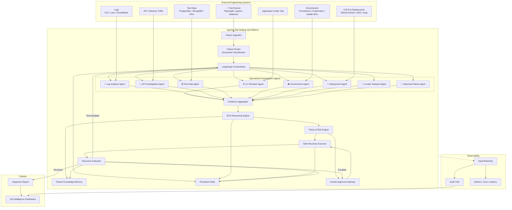
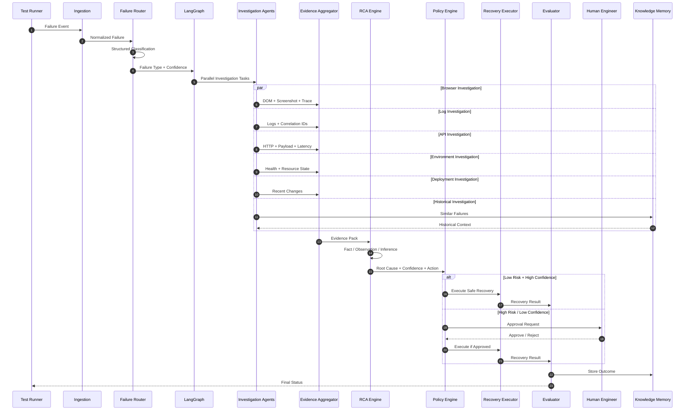

# 🤖 Agentic Self-Healing QA System

### Autonomous Failure Investigation • Evidence-Grounded RCA • Bounded Self-Healing • Human-Controlled Automation

<p align="center">

[](https://github.com/upadrastaharshavardhan/Agentic-Self-Healing-QA-System-HLD)
[](https://www.langchain.com/langgraph)
[](https://www.python.org/)
[](https://playwright.dev/)
[](https://fastapi.tiangolo.com/)
[](https://www.postgresql.org/)
[](https://opentelemetry.io/)
[](https://github.com/upadrastaharshavardhan/Agentic-Self-Healing-QA-System-HLD)

</p>

<p align="center">

**Detect → Investigate → Reason → Decide → Safely Act → Validate → Explain → Escalate**

</p>

<p align="center">

<a href="https://upadrastaharshavardhan.github.io/Agentic-Self-Healing-QA-System-HLD/01_Executive_Summary">
  <strong>📚 Read the Complete HLD Documentation →</strong>
</a>

</p>

---

# 🚀 What Is This?

**Agentic Self-Healing QA System** is an enterprise-oriented AI architecture for autonomously investigating automated test failures, collecting evidence from multiple engineering systems, determining probable root causes, safely executing bounded recovery actions, validating the result, and producing an explainable diagnosis.

The goal is not simply to make failed tests green.

The goal is to answer:

> **Why did this test fail, what evidence proves it, what is safe to do next, and did the recovery actually work?**

Instead of:

```text
Test
  ↓
FAIL
  ↓
Human investigates manually
```

the platform introduces an intelligent investigation layer:

```text
                         TEST FAILURE
                              │
                              ▼
                    ┌───────────────────┐
                    │ Failure Ingestion  │
                    └─────────┬─────────┘
                              │
                              ▼
                    ┌───────────────────┐
                    │ Failure Router     │
                    │ Classification     │
                    └─────────┬─────────┘
                              │
                              ▼
                    ┌───────────────────┐
                    │ LangGraph          │
                    │ Orchestrator       │
                    └─────────┬─────────┘
                              │
             ┌────────────────┼────────────────┐
             │                │                │
             ▼                ▼                ▼
        Browser Agent     Log Agent       API Agent
             │                │                │
             └────────────────┼────────────────┘
                              │
                              ▼
                    ┌───────────────────┐
                    │ Evidence          │
                    │ Aggregator        │
                    └─────────┬─────────┘
                              │
                              ▼
                    ┌───────────────────┐
                    │ RCA Reasoning     │
                    │ Engine            │
                    └─────────┬─────────┘
                              │
                              ▼
                    ┌───────────────────┐
                    │ Policy & Risk     │
                    │ Engine            │
                    └─────────┬─────────┘
                              │
                    ┌─────────┴─────────┐
                    ▼                   ▼
             Safe Autonomous       Human Approval
                 Action                 Gate
                    │                   │
                    └─────────┬─────────┘
                              ▼
                    ┌───────────────────┐
                    │ Recovery          │
                    │ Validation        │
                    └─────────┬─────────┘
                              │
                    ┌─────────┴─────────┐
                    ▼                   ▼
                 RESOLVED            ESCALATED
```

---

# 🧠 The Core Idea

Most self-healing automation focuses on:

```text
Broken Locator
      ↓
Find Another Locator
      ↓
Retry
```

This project goes significantly further.

```text
                    FAILURE
                       │
                       ▼
              What actually failed?
                       │
                       ▼
             What evidence exists?
                       │
          ┌────────────┼────────────┐
          ▼            ▼            ▼
       Browser        Logs         API
          │            │            │
          └────────────┼────────────┘
                       ▼
               Evidence Pack
                       │
                       ▼
                 RCA Reasoning
                       │
                       ▼
             What should happen?
                       │
                       ▼
              Risk / Confidence
                       │
          ┌────────────┴────────────┐
          ▼                         ▼
     Safe Action               Human Approval
          │                         │
          └────────────┬────────────┘
                       ▼
                   Validate
                       │
              ┌────────┴────────┐
              ▼                 ▼
           RESOLVED          ESCALATE
```

> **The system does not blindly heal failures. It investigates failures and heals only when the evidence, confidence, and policy permit it.**

---

# 🎯 Problem Statement

Modern QA organizations can execute thousands of automated tests every day.

The problem is what happens **after a test fails**.

A typical investigation may involve:

```text
Test Failure
     ↓
CI Report
     ↓
Stack Trace
     ↓
Screenshot
     ↓
DOM
     ↓
Browser Console
     ↓
Network Requests
     ↓
API Responses
     ↓
Application Logs
     ↓
Deployment History
     ↓
Environment Health
     ↓
Test Data
     ↓
Previous Failures
     ↓
Retry
     ↓
Root Cause
     ↓
RCA Report
```

This creates:

* High manual triage effort
* Slow developer feedback
* Flaky-test noise
* Repeated investigations
* Inconsistent RCA quality
* Lost organizational knowledge
* Unnecessary retries
* Increased release risk
* Difficulty scaling QA with test volume

---

# 💡 The Solution

The platform introduces an **Agentic Failure Investigation Layer** between test execution and human engineering.

### Traditional QA

```text
Test Runner
    │
    ▼
 FAILURE
    │
    ▼
Human Engineer
```

### Agentic QA

```text
Test Runner
    │
    ▼
Failure Ingestion
    │
    ▼
Failure Classification
    │
    ▼
Agentic Investigation
    │
    ├── Browser
    ├── Logs
    ├── API
    ├── Test Data
    ├── Environment
    ├── Deployment
    ├── Locator
    └── Historical Memory
    │
    ▼
Evidence Aggregation
    │
    ▼
Evidence-Grounded RCA
    │
    ▼
Risk & Policy Decision
    │
    ├── Safe Autonomous Action
    │
    └── Human Approval
    │
    ▼
Recovery Validation
    │
    ├── RESOLVED
    ├── REINVESTIGATE
    └── ESCALATE
```

---

# ✨ Key Capabilities

| Capability                   | Description                                             |
| ---------------------------- | ------------------------------------------------------- |
| 🔍 Failure Detection         | Normalize failures from automated test frameworks       |
| 🧭 Failure Classification    | Categorize failures using structured reasoning          |
| 🧠 Agentic Investigation     | Dynamically determine what evidence is required         |
| 🌐 Browser Investigation     | Analyze DOM, screenshots, traces and console errors     |
| 📜 Log Investigation         | Correlate application, test and infrastructure logs     |
| 🔌 API Investigation         | Analyze HTTP failures, payloads, latency and contracts  |
| 🗄️ Test Data Investigation  | Validate data and test preconditions                    |
| ☁️ Environment Investigation | Analyze service health and resource conditions          |
| 🚀 Deployment Correlation    | Correlate failures with recent deployments              |
| 🎯 Locator Intelligence      | Analyze broken locators and candidate replacements      |
| 🧬 Historical Memory         | Reuse knowledge from previous failures                  |
| 🔎 Evidence Aggregation      | Combine evidence from multiple agents                   |
| 🧠 Explainable RCA           | Separate facts, observations, inferences and hypotheses |
| 🛡️ Bounded Self-Healing     | Execute only policy-approved recovery actions           |
| 👨‍💻 Human-in-the-Loop      | Escalate risky or uncertain decisions                   |
| 🔬 Recovery Validation       | Verify whether recovery actually worked                 |
| 📊 Full Auditability         | Track decisions, tool calls and state transitions       |
| 📈 Observability             | Trace execution using OpenTelemetry                     |

---

# 🏗️ High-Level Architecture



---

# 🤖 Multi-Agent Architecture

The system does not use one giant agent with unrestricted access.

Instead, it uses specialized agents with clearly defined responsibilities.

```text
                     ┌──────────────────────┐
                     │ LangGraph             │
                     │ Orchestrator          │
                     └──────────┬───────────┘
                                │
        ┌───────────────┬───────┼───────┬───────────────┐
        ▼               ▼       ▼       ▼               ▼
   Browser Agent    Log Agent API Agent Data Agent Environment
        │               │       │       │               │
        └───────────────┴───────┼───────┴───────────────┘
                                │
                                ▼
                       Evidence Aggregator
                                │
                                ▼
                           RCA Engine
```

### Specialized Agents

#### 🌐 Browser Agent

Investigates:

* DOM state
* Screenshots
* Playwright traces
* Console errors
* Network requests
* Element visibility
* Locator failures

#### 📜 Log Agent

Investigates:

* Application logs
* Test logs
* Infrastructure logs
* Correlation IDs
* Exceptions
* Error patterns
* Time windows

#### 🔌 API Agent

Investigates:

* HTTP status codes
* Request/response payloads
* API latency
* Contract violations
* Authentication failures
* Dependency failures

#### 🗄️ Test Data Agent

Investigates:

* Missing records
* Invalid test data
* Data state
* Preconditions
* Database/API consistency

#### ☁️ Environment Agent

Investigates:

* Service health
* CPU/memory pressure
* Infrastructure failures
* Kubernetes state
* Environment availability

#### 🚀 Deployment Agent

Investigates:

* Recent deployments
* Version changes
* Commit history
* Configuration changes
* Deployment correlation

#### 🎯 Locator Agent

Investigates:

* Broken selectors
* DOM changes
* Candidate locators
* Locator confidence
* Locator stability

#### 🧬 Historical Failure Agent

Investigates:

* Similar historical failures
* Previous RCA
* Previously successful recovery
* Failure frequency
* Recurring patterns

---

# 🧠 Evidence-Grounded RCA

One of the most important architectural principles is:

> **Evidence before reasoning.**

The RCA engine should not simply generate the most plausible explanation.

It should construct a reasoning chain:

```text
FACT
  ↓
OBSERVATION
  ↓
INFERENCE
  ↓
HYPOTHESIS
  ↓
RECOMMENDATION
```

Example:

```text
FACT
──────────────────────────────
HTTP response = 500


FACT
──────────────────────────────
Application log contains
DatabaseTimeoutException


FACT
──────────────────────────────
Deployment occurred 4 minutes
before failure


OBSERVATION
──────────────────────────────
Failure started immediately
after deployment


HYPOTHESIS
──────────────────────────────
Database connection pool
regression introduced by deployment


CONFIDENCE
──────────────────────────────
0.91


RECOMMENDATION
──────────────────────────────
Do not modify the test.
Escalate application regression.
```

This distinction is critical because **self-healing must not hide real product defects**.

---

# 🛡️ Bounded Self-Healing

The system follows:

```text
Risk
 +
Confidence
 +
Policy
 +
Environment
 +
Action Type
 +
Retry Limits
```

before allowing an autonomous action.

### Risk Model

```text
                 ACTION RISK
                     │
        ┌────────────┼────────────┐
        ▼            ▼            ▼
      LOW          MEDIUM        HIGH
        │            │            │
        ▼            ▼            ▼
   Autonomous     Proposal     Human Approval
        │            │            │
        └────────────┼────────────┘
                     ▼
                 Validation
```

### Example Safe Actions

Potential low-risk actions include:

* Retry a failed test once
* Refresh a browser page
* Reinitialize a browser context
* Re-run a failed API request under policy
* Replace a broken locator when confidence is high
* Recollect missing evidence
* Re-run a deterministic verification step

### Actions That Should Not Be Autonomous

Examples:

* Production code modification
* Database mutation
* Infrastructure changes
* Deployment rollback
* Security-policy modification
* Destructive operations
* Unbounded test rewriting

These should require explicit policy and/or human approval.

---

# 👨‍💻 Human-in-the-Loop

The platform is designed to **assist engineers, not remove engineering judgment**.

```text
LOW RISK + HIGH CONFIDENCE
          │
          ▼
     AUTONOMOUS


MEDIUM RISK
          │
          ▼
      PROPOSAL


HIGH RISK
          │
          ▼
   HUMAN APPROVAL


LOW CONFIDENCE
          │
          ▼
     ESCALATION
```

The system should always be able to say:

> **Insufficient evidence — escalate to engineer.**

That is a successful outcome.

---

# 🔄 End-to-End Investigation Workflow



---

# 🧬 Failure Knowledge Memory

Every investigation can become future knowledge.

```text
Failure
   │
   ▼
Evidence
   │
   ▼
RCA
   │
   ▼
Recovery
   │
   ▼
Validation
   │
   ▼
Outcome
   │
   ▼
Knowledge Memory
```

Future failures can retrieve:

* Similar symptoms
* Similar stack traces
* Previous RCA
* Successful recovery actions
* Failed recovery actions
* Failure frequency
* Environment correlation
* Deployment correlation

This allows the platform to evolve from:

```text
Stateless AI
```

into:

```text
Organizational QA Memory
```

---

# 🔐 Security & Governance

Security is a first-class architectural concern.

### Least Privilege

Agents receive only the tools required for their responsibilities.

```text
Browser Agent
    ├── Screenshot
    ├── DOM
    ├── Console
    └── Trace


Log Agent
    └── Log Search


Deployment Agent
    ├── Deployment History
    └── Version Metadata
```

No agent should receive unrestricted system access.

### Governance Controls

The platform should support:

* Tool-level permissions
* Action allowlists
* Risk classification
* Approval gates
* Retry limits
* Environment restrictions
* Audit logging
* Secret isolation
* Prompt/tool boundary controls
* Complete decision traceability

---

# 📊 Observability

Every meaningful event should be observable.

```text
Failure
   ↓
Classification
   ↓
Agent Invocation
   ↓
Tool Call
   ↓
Evidence
   ↓
RCA
   ↓
Policy Decision
   ↓
Action
   ↓
Validation
   ↓
Final Decision
```

### Observability Signals

| Signal           | Purpose                                |
| ---------------- | -------------------------------------- |
| Traces           | End-to-end investigation visibility    |
| Metrics          | Reliability, latency and cost          |
| Logs             | Detailed execution diagnostics         |
| Audit Trail      | Compliance and decision reconstruction |
| Agent Metrics    | Agent success/failure rates            |
| Tool Metrics     | Tool latency and error rates           |
| RCA Metrics      | Diagnosis quality                      |
| Recovery Metrics | Healing effectiveness                  |

The architecture uses **OpenTelemetry** as the observability foundation.

---

# 🧪 Example Failure Scenarios

## Scenario 1 — Broken Locator

```text
Test Failure
     ↓
ElementNotFound
     ↓
Browser Agent
     ↓
DOM changed
     ↓
Old locator no longer exists
     ↓
Candidate locator discovered
     ↓
High confidence
     ↓
Policy permits locator healing
     ↓
Apply candidate
     ↓
Re-run test
     ↓
PASS
```

### Result

```text
RESOLVED

Root Cause:
UI locator changed

Action:
Locator replacement

Confidence:
High

Human:
Not required
```

---

# Scenario 2 — Real Application Bug

```text
Test Failure
     ↓
HTTP 500
     ↓
API Agent
     ↓
Application logs
     ↓
DatabaseTimeoutException
     ↓
Deployment Agent
     ↓
Recent deployment detected
     ↓
RCA correlation
     ↓
High confidence application regression
     ↓
DO NOT HEAL TEST
     ↓
Escalate
```

### Result

```text
ESCALATED

Root Cause:
Application regression

Action:
No autonomous healing

Reason:
Healing would hide a real defect
```

---

# Scenario 3 — Infrastructure Failure

```text
Test Failure
     ↓
Timeout
     ↓
Browser Agent
     ↓
No DOM progress
     ↓
Environment Agent
     ↓
Service unhealthy
     ↓
Infrastructure incident detected
     ↓
No test modification
     ↓
Escalate
```

---

# Scenario 4 — Flaky Test

```text
Failure
   ↓
Historical Agent
   ↓
Same test failed
multiple times
   ↓
Failure pattern analysis
   ↓
Intermittent timing correlation
   ↓
Flakiness hypothesis
   ↓
Controlled retry
   ↓
PASS
```

The system can classify the event as:

```text
LIKELY_FLAKY
```

rather than incorrectly changing the application or test.

---

# 🆚 Traditional QA vs Agentic Self-Healing QA

| Area                   | Traditional Automation | Agentic Self-Healing QA    |
| ---------------------- | ---------------------- | -------------------------- |
| Failure handling       | Manual investigation   | Autonomous investigation   |
| Root cause             | Engineer-driven        | Evidence-grounded RCA      |
| Browser analysis       | Manual                 | Browser Agent              |
| Logs                   | Manual                 | Log Agent                  |
| APIs                   | Manual                 | API Agent                  |
| Environment            | Manual                 | Environment Agent          |
| Deployment correlation | Manual                 | Deployment Agent           |
| Historical knowledge   | Human memory           | Failure Memory             |
| Healing                | Retry / manual fix     | Policy-controlled recovery |
| Risk control           | Human                  | Policy + Human             |
| Validation             | Manual                 | Recovery Evaluator         |
| Auditability           | Limited                | End-to-end                 |
| Observability          | Test report            | Agent/tool/state telemetry |

---

# 🧠 Why LangGraph?

LangGraph is used as the orchestration foundation because the workflow is not a simple linear chain.

The investigation may need:

```text
                    ┌─────────────┐
                    │ Failure     │
                    │ Classification│
                    └──────┬──────┘
                           │
                    ┌──────▼──────┐
                    │ Investigation│
                    │ Planning     │
                    └──────┬──────┘
                           │
              ┌────────────┼────────────┐
              ▼            ▼            ▼
           Browser        Logs         API
              │            │            │
              └────────────┼────────────┘
                           ▼
                        Evidence
                           │
                           ▼
                           RCA
                           │
                     ┌─────┴─────┐
                     ▼           ▼
                  Recover     Reinvestigate
                     │           │
                     └─────┬─────┘
                           ▼
                       Validate
```

This requires:

* Stateful execution
* Conditional routing
* Parallel investigation
* Loops
* Retries
* Human approval
* Durable state
* Recovery paths
* Explicit termination conditions

---

# 🛠️ Technology Stack

| Layer                      | Technology                                      |
| -------------------------- | ----------------------------------------------- |
| Language                   | Python 3.11+                                    |
| Agent Orchestration        | LangGraph                                       |
| API Layer                  | FastAPI                                         |
| UI Automation              | Playwright                                      |
| Test Framework             | pytest                                          |
| Database                   | PostgreSQL                                      |
| Observability              | OpenTelemetry                                   |
| Logs                       | ELK / Loki / CloudWatch compatible              |
| Infrastructure             | Kubernetes compatible                           |
| CI/CD                      | GitHub Actions / Azure DevOps / Argo compatible |
| AI Models                  | LLM provider abstraction                        |
| Knowledge Memory           | Vector / relational / hybrid memory             |
| Architecture Documentation | Markdown + Mermaid                              |

---

# 📚 Complete HLD Documentation

The complete architecture is divided into nine focused documents.

| #      | Document                                                                                   | Description                                     |
| ------ | ------------------------------------------------------------------------------------------ | ----------------------------------------------- |
| **01** | [📋 Executive Summary](./docs/01_Executive_Summary.md)                                     | Vision, value proposition, principles and scope |
| **02** | [🎯 Problem Statement](./docs/02_Problem_Statement.md)                                     | Current QA failure-investigation problems       |
| **03** | [🚀 Vision & Goals](./docs/03_Vision_and_Goals.md)                                         | Product vision and engineering goals            |
| **04** | [🏗️ High-Level Architecture](./docs/04_High_Level_Architecture.md)                        | Complete system architecture                    |
| **05** | [🔄 Core Workflows & Diagrams](./docs/05_Core_Workflows_and_Diagrams.md)                   | End-to-end workflows and architecture diagrams  |
| **06** | [🤖 Agent & Tool Design](./docs/06_Agent_and_Tool_Design.md)                               | Specialized agents, tools and boundaries        |
| **07** | [🔐 State, Data, Security & Observability](./docs/07_State_Data_Security_Observability.md) | State management, security and telemetry        |
| **08** | [🗺️ MVP Roadmap & Tech Stack](./docs/08_MVP_Roadmap_TechStack.md)                         | Implementation roadmap and technology choices   |
| **09** | [📊 Examples, Risks & Metrics](./docs/09_Examples_Risks_Metrics.md)                        | Examples, risks and measurable outcomes         |

---

# 🌐 Online Documentation

### 📖 Complete HLD Documentation

**[👉 Open Agentic Self-Healing QA System Documentation](https://upadrastaharshavardhan.github.io/Agentic-Self-Healing-QA-System-HLD/01_Executive_Summary)**

The documentation site contains the complete architecture specification.

### 📋 Executive Summary

**[👉 Read Executive Summary](https://upadrastaharshavardhan.github.io/Agentic-Self-Healing-QA-System-HLD/01_Executive_Summary)**

### 🎯 Problem Statement

**[👉 Read Problem Statement](https://upadrastaharshavardhan.github.io/Agentic-Self-Healing-QA-System-HLD/02_Problem_Statement)**

### 🚀 Vision & Goals

**[👉 Read Vision & Goals](https://upadrastaharshavardhan.github.io/Agentic-Self-Healing-QA-System-HLD/03_Vision_and_Goals)**

### 🏗️ High-Level Architecture

**[👉 Read Architecture](https://upadrastaharshavardhan.github.io/Agentic-Self-Healing-QA-System-HLD/04_High_Level_Architecture)**

### 🔄 Core Workflows

**[👉 Read Workflows & Diagrams](https://upadrastaharshavardhan.github.io/Agentic-Self-Healing-QA-System-HLD/05_Core_Workflows_and_Diagrams)**

### 🤖 Agent & Tool Design

**[👉 Read Agent Design](https://upadrastaharshavardhan.github.io/Agentic-Self-Healing-QA-System-HLD/06_Agent_and_Tool_Design)**

### 🔐 State, Security & Observability

**[👉 Read Security & Observability](https://upadrastaharshavardhan.github.io/Agentic-Self-Healing-QA-System-HLD/07_State_Data_Security_Observability)**

### 🗺️ MVP Roadmap

**[👉 Read MVP Roadmap](https://upadrastaharshavardhan.github.io/Agentic-Self-Healing-QA-System-HLD/08_MVP_Roadmap_TechStack)**

### 📊 Examples, Risks & Metrics

**[👉 Read Examples & Metrics](https://upadrastaharshavardhan.github.io/Agentic-Self-Healing-QA-System-HLD/09_Examples_Risks_Metrics)**

---

# 📁 Repository Structure

```text
Agentic-Self-Healing-QA-System-HLD/
│
├── README.md
│
├── COMPLETE_HLD.md
│
├── docs/
│   ├── 01_Executive_Summary.md
│   ├── 02_Problem_Statement.md
│   ├── 03_Vision_and_Goals.md
│   ├── 04_High_Level_Architecture.md
│   ├── 05_Core_Workflows_and_Diagrams.md
│   ├── 06_Agent_and_Tool_Design.md
│   ├── 07_State_Data_Security_Observability.md
│   ├── 08_MVP_Roadmap_TechStack.md
│   └── 09_Examples_Risks_Metrics.md
│
├── diagrams/
│   ├── architecture/
│   ├── workflows/
│   ├── agents/
│   ├── state/
│   └── security/
│
└── .github/
    └── workflows/
        └── pages.yml
```

---

# 🗺️ Implementation Roadmap

## Phase 0 — Architecture Foundation

* [x] Define system vision
* [x] Define problem statement
* [x] Define architectural principles
* [x] Define high-level architecture
* [x] Define agent topology
* [x] Define investigation workflows
* [x] Define security boundaries
* [x] Define observability strategy
* [x] Define MVP roadmap

---

## Phase 1 — Failure Investigation MVP

```text
Failure
   ↓
Classification
   ↓
Browser + Logs
   ↓
Evidence Aggregation
   ↓
RCA
   ↓
Diagnosis
```

Focus:

* Failure ingestion
* Structured classification
* Browser investigation
* Log investigation
* Evidence model
* Initial RCA engine

---

## Phase 2 — Multi-Agent Investigation

Add:

* API Agent
* Environment Agent
* Deployment Agent
* Test Data Agent
* Locator Agent
* Historical Failure Agent
* Parallel investigation
* LangGraph state management

---

## Phase 3 — Bounded Self-Healing

Add:

* Policy engine
* Risk classification
* Recovery executor
* Safe retry
* Locator healing
* Browser recovery
* Recovery validation
* Human approval

---

## Phase 4 — Intelligence & Memory

Add:

* Failure knowledge graph
* Semantic failure retrieval
* Historical RCA reuse
* Failure clustering
* Pattern detection
* Predictive failure classification

---

## Phase 5 — Enterprise Platform

Add:

* Multi-project support
* Multi-environment support
* RBAC
* Enterprise authentication
* Governance
* Cost controls
* Advanced dashboards
* SLO/SLA monitoring
* Enterprise integrations

---

# 📊 Success Metrics

The platform should be evaluated using measurable engineering outcomes.

### Investigation Metrics

```text
Mean Time To Investigate
Mean Time To Root Cause
Evidence Collection Latency
RCA Confidence
```

### Self-Healing Metrics

```text
Healing Success Rate
Recovery Validation Rate
False Healing Rate
Recovery Regression Rate
```

### Safety Metrics

```text
Unsafe Action Rate
Human Escalation Rate
Policy Violation Rate
High-Risk Approval Rate
```

### AI Quality Metrics

```text
RCA Accuracy
Evidence Grounding
Hallucination Rate
Tool Selection Accuracy
Investigation Efficiency
```

### Platform Metrics

```text
Agent Latency
Tool Latency
LLM Cost
Workflow Duration
Failure Recurrence
Knowledge Reuse Rate
```

---

# 🧪 Evaluation Philosophy

The most important metric is not:

```text
How many tests did the AI make green?
```

It is:

```text
How often did the system correctly determine
WHY the test failed without masking a real defect?
```

A successful system should optimize:

```text
Correct Diagnosis
        +
Safe Recovery
        +
Validated Outcome
        +
Explainability
        +
Low False Healing
```

---

# ⚠️ Safety Principles

This platform intentionally avoids the philosophy:

> **"AI should fix everything automatically."**

Instead:

```text
Known + Safe + High Confidence
              ↓
         Auto Recover


Unknown + Medium Confidence
              ↓
            Review


High Risk + Any Confidence
              ↓
        Human Approval


Insufficient Evidence
              ↓
          Escalate
```

The ability to **refuse to heal** is a core capability.

---

# 🚫 MVP Out of Scope

The initial MVP does not attempt to:

* Modify production application code autonomously
* Perform unrestricted test rewriting
* Perform unrestricted infrastructure changes
* Execute destructive database operations
* Automatically rollback production deployments
* Handle every possible failure category
* Give agents unrestricted tool access

---

# 🔮 Future Vision

The long-term vision is to evolve this architecture into an **AI Quality Engineering Operating System**.

```text
                    ┌──────────────────────────┐
                    │      AI QA Platform      │
                    └────────────┬─────────────┘
                                 │
       ┌─────────────┬───────────┼───────────┬─────────────┐
       ▼             ▼           ▼           ▼             ▼
   Test Design   Execution    Healing      RCA       Prediction
       │             │           │           │             │
       └─────────────┴───────────┼───────────┴─────────────┘
                                 │
                                 ▼
                       QA Intelligence Layer
                                 │
                    ┌────────────┴────────────┐
                    ▼                         ▼
               Knowledge                 Governance
                 Memory                    & Safety
```

Potential future capabilities:

* Autonomous test generation
* Predictive test selection
* Release-risk intelligence
* Root-cause knowledge graph
* AI-driven flaky-test detection
* Accessibility investigation
* Security investigation
* Performance investigation
* Autonomous CI/CD decisions
* Cross-project QA knowledge
* Natural-language QA engineering assistant

---

# 🏆 What Makes This Architecture Different?

### 1. Investigation Before Healing

It does not immediately modify the test.

### 2. Evidence Before Reasoning

Every RCA must be grounded in collected evidence.

### 3. Specialized Agents

Different failure dimensions are investigated by specialized agents.

### 4. Bounded Autonomy

Agents operate within explicit policies and risk limits.

### 5. Human-Controlled Risk

High-risk decisions remain under human control.

### 6. Recovery Validation

The system verifies that the recovery actually worked.

### 7. Historical Memory

Previous failures become reusable engineering knowledge.

### 8. Full Observability

Every meaningful decision and action is traceable.

---

# 🔗 Important Links

| Resource             | Link                                                                                                                     |
| -------------------- | ------------------------------------------------------------------------------------------------------------------------ |
| 📦 GitHub Repository | [Agentic-Self-Healing-QA-System-HLD](https://github.com/upadrastaharshavardhan/Agentic-Self-Healing-QA-System-HLD)       |
| 📚 HLD Documentation | [GitHub Pages](https://upadrastaharshavardhan.github.io/Agentic-Self-Healing-QA-System-HLD/01_Executive_Summary)         |
| 📋 Executive Summary | [Read](https://upadrastaharshavardhan.github.io/Agentic-Self-Healing-QA-System-HLD/01_Executive_Summary)                 |
| 🏗️ Architecture     | [Read](https://upadrastaharshavardhan.github.io/Agentic-Self-Healing-QA-System-HLD/04_High_Level_Architecture)           |
| 🔄 Workflows         | [Read](https://upadrastaharshavardhan.github.io/Agentic-Self-Healing-QA-System-HLD/05_Core_Workflows_and_Diagrams)       |
| 🤖 Agent Design      | [Read](https://upadrastaharshavardhan.github.io/Agentic-Self-Healing-QA-System-HLD/06_Agent_and_Tool_Design)             |
| 🔐 Security          | [Read](https://upadrastaharshavardhan.github.io/Agentic-Self-Healing-QA-System-HLD/07_State_Data_Security_Observability) |
| 🗺️ Roadmap          | [Read](https://upadrastaharshavardhan.github.io/Agentic-Self-Healing-QA-System-HLD/08_MVP_Roadmap_TechStack)             |
| 📊 Metrics           | [Read](https://upadrastaharshavardhan.github.io/Agentic-Self-Healing-QA-System-HLD/09_Examples_Risks_Metrics)            |

---

# 🤝 Contributing

Contributions, architecture discussions, ideas, and improvements are welcome.

Before submitting a change:

1. Understand the architecture.
2. Keep agent responsibilities bounded.
3. Preserve deterministic-first workflows.
4. Do not introduce unrestricted autonomous actions.
5. Add observability for new agent/tool behavior.
6. Update the corresponding HLD documentation.
7. Add diagrams when architectural behavior changes.

---

# 📜 License

This project is intended as an architecture, research, and portfolio reference for building production-oriented Agentic QA systems.

See the repository license for the applicable terms.

---

# 👨‍💻 Author

## Harsha Vardhan Upadrasta

**AI Automation Engineer • QA Automation Architect • Agentic AI Engineer**

Building systems at the intersection of:

```text
AI
+
Agentic Workflows
+
Quality Engineering
+
Test Automation
+
Software Architecture
+
Developer Productivity
```

---

<p align="center">

### 🤖 Agentic Self-Healing QA System

**Don't just retry the test. Investigate the failure.**

**Evidence → Reasoning → Decision → Controlled Action → Validation**

</p>

<p align="center">

<a href="https://upadrastaharshavardhan.github.io/Agentic-Self-Healing-QA-System-HLD/01_Executive_Summary">
📚 Read the Complete HLD
</a>
&nbsp;&nbsp;•&nbsp;&nbsp;
<a href="https://github.com/upadrastaharshavardhan/Agentic-Self-Healing-QA-System-HLD">
⭐ View on GitHub
</a>

</p>
